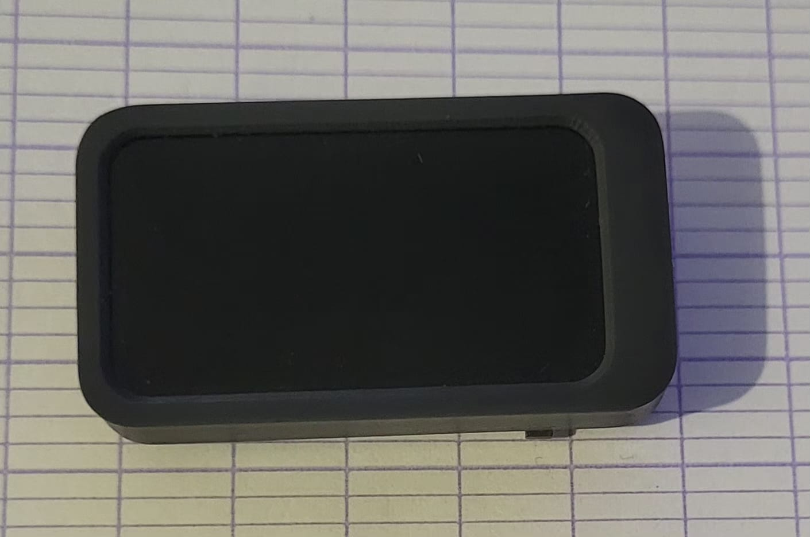
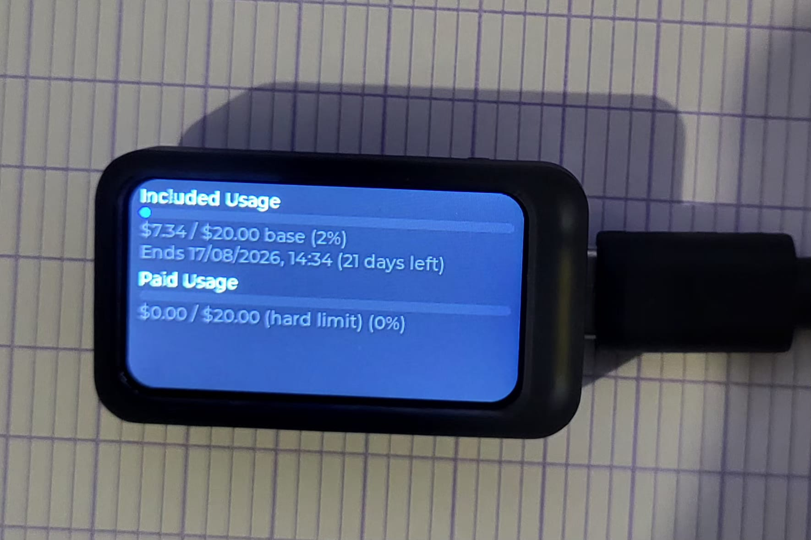

# Cursor Metrics

A small **Cursor usage dashboard** on your desk: a desktop app fetches your Cursor billing usage from the API and pushes it to an **ESP32-C6** board with a 1.47″ LCD. Included and paid usage bars update on a schedule over Transport choosen (default USB serial).

| | |
|---|---|
| **Board c6-lcd-147** |  |
| **Live Sync** |  |


## How it works

```text
Cursor API  →  Desktop app (collect → process)  →  Transport layer (USB serial)  →  ESP32 LVGL UI
```

- **Desktop** ([`app/`](app/)): Bun + Effect service — `GET /api/usage-summary`, maps to a versioned `UsageSummary` payload, publishes via config-driven transport (log, serial,...).
- **Firmware** ([`firmware/board/c6_lcd_147/cursor_metrics/`](firmware/board/c6_lcd_147/cursor_metrics/)): LVGL 8.3 UI on Waveshare ESP32-C6-LCD-1.47; receives newline-delimited JSON and updates the screen.

Details: 
- [Desktop app](app/README.md) 

- [Firmware](firmware/board/c6_lcd_147/cursor_metrics/README.md)

## Hardware

| Item | Link |
|------|------|
| **Board** | [Waveshare ESP32-C6-LCD-1.47 on Amazon](https://www.amazon.fr/dp/B0DHTMYTCY?ref=ppx_yo2ov_dt_b_fed_asin_title) (also on [Waveshare wiki](https://www.waveshare.com/wiki/ESP32-C6-LCD-1.47)) |
| **3D case** | Print [`firmware/3D/ESP32C6_147.stl`](firmware/3D/ESP32C6_147.stl) |

USB-C cable required. Panel: 172×320 ST7789, UI layout **320×172 landscape**.

## Quick start — serial mode

Use this flow to show **live Cursor usage** on the board.

### 1. Flash the firmware (first time)

Plug the board via USB-C, then:

```bash
cd firmware/board/c6_lcd_147/cursor_metrics
pio run -t upload
```

If upload fails: hold **BOOT**, press **RESET**, release **RESET**, release **BOOT**, retry.

You should see demo metrics on the LCD and boot logs if you run `pio device monitor` (close the monitor before step 3).

### 2. Configure the desktop app

```bash
cd app
cp .env.example .env
```

Edit `.env`:

```env
TRANSPORT=serial
SERIAL_PORT=/dev/cu.usbmodem101    # your port — see below
SERIAL_BAUD_RATE=115200
SYNC_INTERVAL=10 minutes

CURSOR_SESSION_TOKEN=...             # see below
```

**Serial port (macOS):** list devices with `ls /dev/cu.*` — use a `cu.*` path (e.g. `/dev/cu.usbmodem101`), not `tty.*`.

**`CURSOR_SESSION_TOKEN`:** log in at [cursor.com](https://cursor.com), open DevTools → **Application** → **Cookies** → `cursor.com`, copy the value of **`WorkosCursorSessionToken`**. Paste it into `.env` (no quotes). Refresh when you get 401 errors.

Install dependencies:

```bash
bun install
```

### 3. Run sync over serial

Close any serial monitor — only one program can use the port.

```bash
bun run sync:serial
```

The app fetches usage immediately, then on every `SYNC_INTERVAL`. The LCD updates when a valid JSON line is received.

One-shot test:

```bash
bun run sync:once:serial
```

> Serial transport uses the **Node** runtime (`sync:serial` / `sync:once:serial`) for reliable USB serial on macOS. Log-only mode works with `bun run sync:once` and `TRANSPORT=log`.

## Project layout

```text
app/                          Desktop service (Bun + Effect)
firmware/
  board/c6_lcd_147/cursor_metrics/   PlatformIO firmware + LVGL UI
  images/                       Photos for docs
  3D/ESP32C6_147.stl            Printable case
```

## License

[MIT](LICENSE) — open source; use and modify freely.
