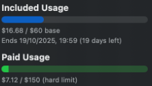

# Cursor Metrics — ESP32-C6-LCD-1.47 firmware

LVGL **8.3.11** dashboard for the Waveshare [ESP32-C6-LCD-1.47](https://www.waveshare.com/wiki/ESP32-C6-LCD-1.47): **320×172 landscape** UI on a 172×320 ST7789 panel.

Receives newline-delimited `UsageSummary` JSON from the [desktop app](../../../app/README.md) over USB serial (115200 baud) and updates bars and labels via `ui_apply_metrics()`.



## Prerequisites

- [PlatformIO](https://platformio.org/) (CLI or VS Code extension)
- USB-C cable
- SquareLine Studio (optional) — [squareline/README.md](squareline/README.md)

First build downloads the [pioarduino](https://github.com/pioarduino/platform-espressif32) ESP32-C6 toolchain (~1–2 GB).

**USB CDC:** `platformio.ini` sets `ARDUINO_USB_CDC_ON_BOOT=1` so `Serial` works on the native USB port (required on this board).

## Build & flash

```bash
cd firmware/board/c6_lcd_147/cursor_metrics
pio run -t upload
```

Optional monitor (close before running desktop `sync:serial`):

```bash
pio device monitor
```

Expected boot log:

```text
cursor_metrics: boot
display: LVGL ready (320x172 landscape)
serial: listening
cursor_metrics: UI ready
```

Upload fails → hold **BOOT**, press **RESET**, release **RESET**, release **BOOT**, retry.

## Runtime behavior

1. **Boot:** demo metrics on screen until the first valid serial line.
2. **Loop:** `serial_receiver_poll()` reads USB, parses JSON (`schemaVersion: 1`), calls `ui_apply_metrics()`.
3. **Desktop:** run [app `sync:serial`](../../../app/README.md) with `TRANSPORT=serial` and matching `SERIAL_PORT`.

## Project layout

```text
src/
  main.cpp              Boot, demo fallback, LVGL loop
  display/              ST7789 + LVGL driver
  serial/               JSON line receiver
  ui/                   SquareLine export (generated — do not edit)
  ui_metrics/           ui_apply_metrics() — safe across UI re-exports
squareline/             SquareLine .spj
include/lv_conf.h
```

UI changes: edit `squareline/cursor_metrics.spj`, export to `src/ui/`, keep widget names — see [squareline/README.md](squareline/README.md). Put runtime logic only in `ui_metrics/`.

## LVGL version lock

| Component | Version |
|-----------|---------|
| `lib_deps` | `lvgl/lvgl@8.3.11` |
| SquareLine project | **8.3.11** |

## Pin map (Waveshare wiki)

| LCD | GPIO |
|-----|------|
| MOSI | 6 |
| SCLK | 7 |
| CS | 14 |
| DC | 15 |
| RST | 21 |
| BL | 22 |

## Hardware & case

- Board: [Amazon FR](https://www.amazon.fr/dp/B0DHTMYTCY?ref=ppx_yo2ov_dt_b_fed_asin_title) · [Waveshare wiki](https://www.waveshare.com/wiki/ESP32-C6-LCD-1.47)
- 3D case: [`firmware/3D/ESP32C6_147.stl`](../../../3D/ESP32C6_147.stl)

## Troubleshooting

| Issue | Fix |
|-------|-----|
| Blank screen / no serial | Re-flash with USB CDC flags in `platformio.ini`; press RESET |
| Demo never updates | Close serial monitor; confirm desktop `TRANSPORT=serial` and correct `cu.*` port |
| Wrong orientation | `setRotation(0..3)` in `display_st7789.cpp` (landscape = `1`) |
| Wrong colors | `invertDisplay(true)` is enabled for this panel |
| SquareLine export breaks build | Match LVGL **8.3.11** |
